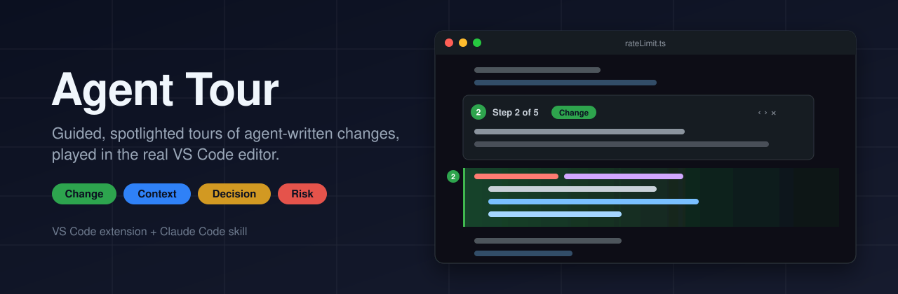

<p align="center">
  
</p>

<p align="center">
  <a href="https://github.com/SuryanshBVerma/agent-tour/actions/workflows/ci.yml"></a>
  <a href="https://github.com/SuryanshBVerma/agent-tour/releases/latest"></a>
  <a href="LICENSE"></a>
  
</p>

<p align="center">
  <a href="https://github.com/SuryanshBVerma/agent-tour/releases/latest/download/agent-tour.vsix"><b>Download the extension (.vsix)</b></a>
  ·
  <a href="https://github.com/SuryanshBVerma/agent-tour/releases/latest/download/code-tour-skill.zip"><b>Download the skill</b></a>
</p>

---

A coding agent has just changed twelve files. Instead of scrolling through the diff, you get a
**tour**: the agent walks you through the change in the order that makes sense, one step at a
time, **in your real editor**. The lines that matter are spotlighted, everything else is dimmed,
and a card explains *what* changed, *why* it was done that way, and *what to watch for*.

Agent Tour has two parts:

- **The VS Code extension** plays tours: it spotlights each step, shows the card, and gives you
  keyboard navigation and a sidebar list of steps.
- **The `code-tour` skill** teaches Claude Code to write good tours. It covers ordering, the
  What/Why/Watch-for pattern and flagging risks, and ships a validator that checks every tour
  against the real files before you ever see it.

## How it works

```
 agent finishes a change
        │
        ▼
 code-tour skill ── git diff ──► orders hunks into a story ──► writes a draft tour
        │
        ▼
 validate-tour.mjs --publish ── schema, files, ranges, anchors ──► temp slot for this workspace
        │                                          (never inside your repository)
        ▼
 Agent Tour extension ── notices the new tour ──► "Start Tour" ──► spotlight + card, step by step
```

Tours are **temporary**. Each workspace has one slot in a per-user temp folder, and every new
tour replaces the previous one. Nothing is written to your repository, so there's nothing to
`.gitignore` or accidentally commit.

## Install

### 1. The extension

Requires **VS Code 1.90 or later**. Download [`agent-tour.vsix`](https://github.com/SuryanshBVerma/agent-tour/releases/latest/download/agent-tour.vsix), then:

```bash
code --install-extension agent-tour.vsix
```

Reload VS Code afterwards (**Developer: Reload Window**).

> [!IMPORTANT]
> `--install-extension` installs into your **Default** profile only. If your project opens in
> another VS Code profile, add `--profile "<name>"`. Otherwise, start links fail with
> *"The extension 'agent-tour.agent-tour' cannot be installed because it was not found"*.

### 2. The skill (Claude Code)

Unpack [`code-tour-skill.zip`](https://github.com/SuryanshBVerma/agent-tour/releases/latest/download/code-tour-skill.zip)
into your Claude Code skills folder, for all projects:

```bash
mkdir -p ~/.claude/skills && unzip -o code-tour-skill.zip -d ~/.claude/skills/
```

```powershell
Expand-Archive code-tour-skill.zip -DestinationPath "$env:USERPROFILE\.claude\skills" -Force
```

Or unpack it into `<project>/.claude/skills/` to share it with a team through the repository.
The validator needs only **Node.js 18 or later**.

## Use

After a multi-file change, Claude Code offers a tour on its own, or you can ask:

> give me a tour of what you changed

A **Start Tour** notification appears, and the tour is also listed under **Explorer → Agent
Tours**.

| Key | Action |
|---|---|
| `Alt+]` | Next step |
| `Alt+[` | Previous step |
| `Alt+H` | Show the step card again |
| `Esc` | Stop the tour |

The card's title bar and the status bar also have ‹ › × buttons. Commands: **Agent Tour: Start
Tour...**, **Reload Tours**, **Stop Tour**.

### What the colors mean

| Kind | Color | Meaning |
|---|---|---|
| **Change** | 🟩 green | New or modified code |
| **Context** | 🟦 blue | Unchanged code you need in order to follow a change |
| **Decision** | 🟨 amber | A design choice where your judgement is needed |
| **Risk** | 🟥 red | Code the agent isn't confident about, or where a mistake would be severe |
| Stale | 🟧 orange, dashed | The code changed after the tour was written; shown without the spotlight |

Colors come from theme colors (`agentTour.*`), so you can override them in your theme settings.

### Settings

| Setting | Default | |
|---|---|---|
| `agentTour.autoStart` | `"prompt"` | `off`, `prompt` (show a Start Tour notification) or `on` (start when you've been idle for 3 s) |
| `agentTour.cardStyle` | `"inline"` | `inline`: a card above the step that stays open. `hover`: a hover card that closes when you click away |
| `agentTour.dimMode` | `"opacity"` | `opacity`, `wash` (background tint) or `off` |
| `agentTour.dimOpacity` | `0.35` | Opacity of code outside the step (0.05–1) |

## Robust to code that moves

Each step records an **anchor**, a snippet of its first line. If you edit the file after the
tour was written, the extension finds the step again, whether exactly, nearby, or after
reformatting, and says it **moved N lines**. If the code is gone, the step is marked **stale**
rather than confidently highlighting the wrong lines. If a file is missing, the tour skips
past it instead of breaking.

## Security

Tours are written by an agent, so the extension treats them as untrusted input:

- **Only your workspace.** A tour can only open files inside the workspace. Absolute paths,
  `..` and symlinks or junctions that lead outside are rejected, in both the extension and the
  validator.
- **Nothing in a card can act on its own.** Card text is Markdown with HTML disabled, images
  neutralized (no network fetches) and no command links. The only commands a card can run are
  this extension's own Previous, Next and Stop.
- **Private tour folder.** On Linux and macOS it's created private to you (`0700`) and refused
  if another user owns it or can write to it. On Windows, `%TEMP%` is already per-user.
- **Workspace Trust.** In untrusted workspaces, tours never auto-start, start links are
  refused, and workspace settings can't turn on auto-start.
- **Local only.** No network access and no telemetry.

See [SECURITY.md](SECURITY.md) to report a vulnerability.

## Development

```bash
cd extension
npm ci
npm run compile      # tsc + rebuild the skill's bundled validator
npm test             # integration tests in VS Code 1.90, the minimum supported (downloads it on first run)
npm run test:skill   # validator tests (plain node)
npm run package      # builds agent-tour.vsix
```

Press **F5** in VS Code (**Run Agent Tour (sample workspace)**) to try it on the bundled sample
workspace with a sample tour.

| Path | What |
|---|---|
| `extension/src/` | The extension: player, spotlight, cards, store, anchor resolver, tree |
| `extension/schema/tour.schema.json` | The tour format (canonical) |
| `extension/skill-src/` | Source of the skill's validator CLI |
| `skill/code-tour/` | The skill as shipped: `SKILL.md`, bundled validator, schema copy, example |
| `docs/` | Implementation plan, decision log, manual test checklists |

`skill/code-tour/scripts/validate-tour.mjs` is **generated**. `npm run compile` rebuilds it, and
CI fails if the committed copy is stale (`npm run check:skill`).

### Releasing

1. Update `version` in `extension/package.json` and add a section to [CHANGELOG.md](CHANGELOG.md).
2. Commit, then tag and push:
   ```bash
   git tag v0.1.0 && git push origin v0.1.0
   ```
3. The [release workflow](.github/workflows/release.yml) runs the tests, builds
   `agent-tour.vsix` and `code-tour-skill.zip`, and attaches them to a GitHub Release.

Every push and pull request also runs [CI](.github/workflows/ci.yml) on Ubuntu and Windows and
uploads the built `.vsix` as a workflow artifact.

## Status and limits

This is **v0.1.0**, a working proof of concept. Known limits:

- The agent's workspace root must be the folder open in VS Code. Opening a subfolder of the
  repository won't find the tour.
- One tour per workspace at a time, by design.
- Opacity dimming relies on undocumented VS Code decoration behavior. If an update breaks it,
  switch `agentTour.dimMode` to `wash`.
- The first time an inline card appears in a session, VS Code may open the Comments panel
  (setting `comments.openView`).
- Not published to the VS Code Marketplace; install from the `.vsix`.

## License

[MIT](LICENSE)
